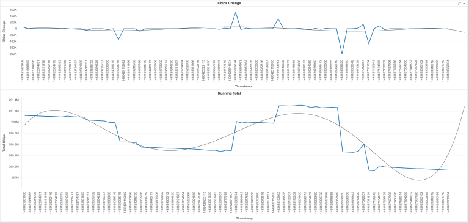
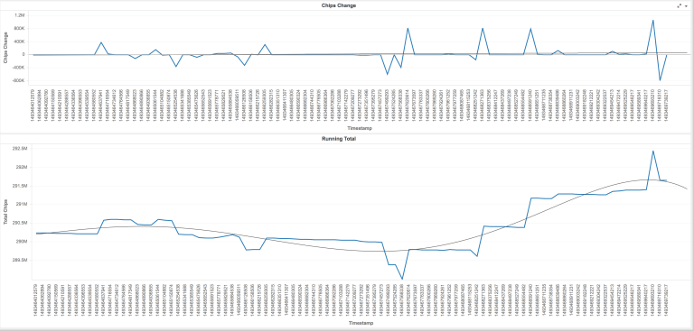
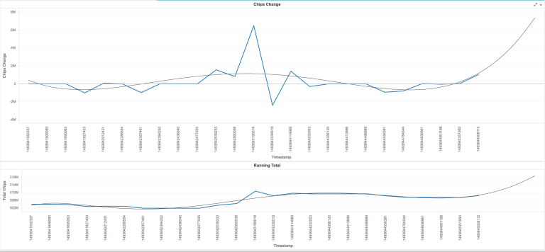
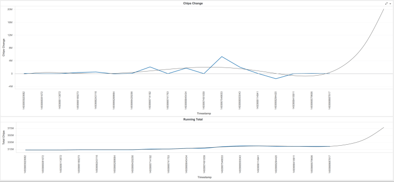
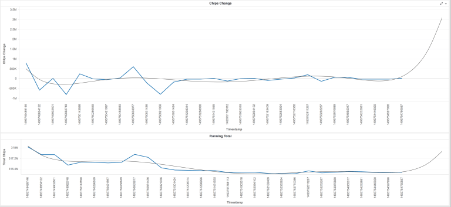

# Hold'em Poker Framework for macOS


## Contributions
My focus is currently not on further developing this project, but I will review pull requests. If you'd like to help, pull requests are openly welcome.

## Coffee
If you found this project interesting or useful, buy me a coffee using any of these:
- SmartCash: SR8CMmWAjG3wiRrK5F72Xx7HyUSNUnE9eb
- XRP: rDsbeomae4FXwgQTJp9Rs64Qg9vDiTCdBv destinationTag: 92824144
- LTC: MBDsV17EfXP5BrsEgDgAKiTMXWwQeHEgPf
- BTC: 3HF6E6gqv7FN3W8hAkJeM2bXuu4sUrRMYK

## Abstract
This started as an experiment on April 2017. I wanted to see how challenging it would be to build a system that could follow a game of poker on-screen, and understand every step of the game.

I’ve designed almost every component of this experiment to be as dynamic as possible, with the long-term goal being a complete poker system that can be easily re-adapted for different Texas HoldEm interfaces with minimal work and preferably without recompiling the whole project.

The current setup worked better than expected, in the time I worked on this. The bot played well for hours on end, as long as the computer was left running.

## Related Tools
These tools were leveraged, adapted or built while this experiment was in progress:
- [Caffe Indexer](https://github.com/tiagosiebler/CaffeIndexer)
  - Speed up classfiying images and removing noise, for anything onscreen that wasn't recognised, using a manually trained Caffe model.
  - Drastically sped up the [recognition challenge](#whats-next) mentioned further down.
- [Caffe Card Classifier](https://github.com/tiagosiebler/CaffeClassifierMac)
  - Use a pre-trained neural network to estimate what playing card is currently in an image.
  - Output returns top 5 matches in JSON format, each with a degree of confidence.
  - Similar to the indexer, without the UI.
- [Caffe Dataset Prep](https://github.com/tiagosiebler/CaffeDatasetPrep)
  - Prepare the dataset used to train teh caffe model, using NVidia DIGITS.
  - Multiplies the dataset though might encourage overfitting. A useful side-effect, to the degree I needed this.
- [Pixel Ruler](https://github.com/tiagosiebler/PixelRuler)
  - Some offsets were done based on relative pixels, that's how this bot knows where to look for cards and other known images.
  - This modification of a pixel ruler found online helps take these measurements to configure the bot.
- [Podds](https://github.com/lostella/podds)
  - Multithreaded poker odds evaluation tool.
  - This would've been much harder without [Lorenzo](https://github.com/lostella)'s work on Podds, huge thanks to that!
- [OpenCV](https://opencv.org/)
  - Much image recognition and processing [depends](/Universal%20Poker%20Bot/CVClasses) on OpenCV

# Development Milestones
Here's a breakdown on progress made.

## 17 April 2017 - The Beginning
### Zynga Texas HoldEm Poker

To start with I’ve decided to use the popular facebook-based Texas HoldEm Poker run by Zynga. It’s free to play, all game money is free money (unless you make the choice to buy more chips from Zynga), and it should provide a reliable starting system to test the effectiveness of this system in a real environment.

Since this system is designed to run on my personal macbook pro, the API is built with various components written in either C, C++, or Objective-C; depending on whether 3rd-party API was used.

Various features of the interface can be used to determine the state of the game. The player state has been split into the following states:

- kPlayerStateInLobby,
- kPlayerStateWaitingForSeat,
- kPlayerStateSeated,
- kPlayerStateWaitingForHand,
- kPlayerStateWaitingForTurn,
- kPlayerStateTurn,
- kPlayerStateUnknown

Each of these states is key for the API to understand what is needed of it. Reliably determining each of these also has a number of challenges associated. It's certainly not impossible, but it's not always reliable.

With time the methods that drive this workflow will improve, right now the goal is finishing the proof of concept to the point where it's a semi-automated bingo-bot.

Once that's done, work will continue into a more advanced decision making process all the way to the river stage of the game.

### Bingo Bot

What is a bingo bot, in the context of HoldEm poker? Check out this thread:

http://pokerbot.forumotion.com/t211-pokerman-bingo

This is a relatively "simple" poker bot that takes the pocket-cards that have a higher probability of winning, and plays the lazy tactic of going all-in in the pre-flop stage of the game. It's not always reliable, but can bring significant results in the long-term due to the probabilities involved. Not only does it have the potential of significant results by playing with the highest odds, but it's also the easiest to program, since we only need to check for pocket cards and the probabilities involved before going all-in or folding.

The simplest form uses the current pocket cards in the decision making process, and goes all-in when specific cards are found. From past experimenting with the AutoIt bot for windows, these are the pocket cards I wanted to experiment with (since they've brought results for me in the past): AA KK QQ JJ AJ AK TT 99 88 77 AQ KQ.

In the current state of my poker bot for mac, this is relatively easy to check for:

<details>
<summary>Snippet</summary>
```
NSString *pocketCards = self.pokerTable.myPlayer.getPocketCards;
NSLog(@"got pocket cards: %@",pocketCards);

NSString *allInCardsStr = @"AA KK QQ JJ AJ AK TT 99 88 77 AQ KQ";
NSSet *allInCardsSet = [NSSet setWithArray:[allInCardsStr componentsSeparatedByString:@" "]];

NSLog(@"checking if cards (%@) are found in set: %@", pocketCards, allInCardsStr);
bool shouldAllIn = [allInCardsSet containsObject:pocketCards];
```
</details>

If a match is found, the bot will go all in.

### Results
In one instance the results were extremely encouraging, but the dataset is too small to be significant. The bot played an estimated 12 hands in $2/4k blinds and made a profit of $4.6 million.

Technically that may either be one or two really lucky wins, or several combined. Either way, results are results, and signs of progress are motivation to keep digging further into this challenge.

This form of bingo-botting isn't reliable enough though for my liking.

Why? It uses predefined pocket cards rather than real odds. The probabilities of winning vary depending on not just the cards in your hand, but also the number of players involved.

This kind of preflop recognition doesn't account for that. The next posts cover how I addressed that.

---
## 22 April 2017 - Preflop Odds - Building a Better Bingo Bot

I showcased some of the first results of my poker experiment. The automated logic running my poker bot has been set to wait for specific pocket cards in the preflop, and if a match is found, simply go all in:
<details>
<summary>Snippet</summary>
```
NSString *allInCardsStr = @"AA KK QQ JJ AJ AK TT 99 88 77 AQ KQ";
NSSet *allInCardsSet = [NSSet setWithArray:[allInCardsStr componentsSeparatedByString:@" "]];
NSLog(@"checking if cards (%@) are found in set: %@",pocketCards, allInCardsStr);
shouldAllIn = [allInCardsSet containsObject:pocketCards];
```
</details>

This kind of “bingo botting” has potential, and has yielded results so far, but there is still too much luck and too much risk involved for my liking. Probabilities of winning change depending on the number of players, and this logic doesn’t account for that. This something that can benefit from refined control.

These are the odds involved in the preflop for some of these cards of interest:
<details>
<summary>Probabilities for players in game vs starting hand</summary>
```
     2      3      4      5      6      7      8      9
AA   0.851  0.733  0.634  0.557  0.489  0.431  0.384  0.343
KK   0.822  0.688  0.581  0.495  0.426  0.372  0.326  0.290
QQ   0.796  0.644  0.533  0.443  0.375  0.322  0.279  0.246
JJ   0.771  0.608  0.489  0.399  0.333  0.282  0.243  0.213
TT   0.748  0.573  0.448  0.360  0.294  0.246  0.213  0.186
99   0.716  0.534  0.409  0.322  0.262  0.222  0.191  0.168
88   0.689  0.497  0.373  0.292  0.235  0.198  0.175  0.154
77   0.657  0.461  0.338  0.264  0.214  0.182  0.160  0.145

            Suited
AK   0.663  0.499  0.406  0.345  0.302  0.267  0.241  0.217
AQ   0.663  0.483  0.388  0.323  0.282  0.249  0.221  0.200
AJ   0.664  0.472  0.372  0.310  0.267  0.235  0.210  0.188
KQ   0.625  0.462  0.373  0.316  0.275  0.243  0.215  0.196
KJ   0.615  0.446  0.358  0.298  0.259  0.227  0.204  0.182
KT   0.605  0.435  0.341  0.288  0.247  0.214  0.191  0.172

            Unsuited
AK   0.643  0.475  0.376  0.316  0.269  0.235  0.206  0.185
AQ   0.645  0.457  0.357  0.293  0.249  0.215  0.186  0.165
AJ   0.625  0.442  0.339  0.276  0.232  0.198  0.171  0.150
KQ   0.603  0.433  0.342  0.283  0.241  0.208  0.181  0.159
KJ   0.593  0.419  0.325  0.263  0.223  0.189  0.165  0.146
KT   0.584  0.404  0.309  0.252  0.210  0.179  0.154  0.135
```
</details>

Note the sharp variations depending on not just the number of players involved, but also in whether or not your cards have the same suit. These numbers were calculated using the same probability simulator used within the poker bot, with 200000 simulations based on the number of players available and the cards currently visible, assuming no one ever folds. The results can also be replicated online with various browser based odds simulators, and should approximately fix these measurements.

Reviewing the table above we’ll gain a clearer picture why it might not be a good idea to go all in with an unsuited AK with 9 people in play, compared to 2 or 3 people in play. With 2 people in play, chances are you’ll win more often than you lose. These odds decrease slightly with a larger number of players, where with 9 players you can expect to win less than 20% of your attempts.

This is the resulting preflop logic for the current bingo-based poker bot, tweaked based on experimentation:

<details>
<summary>Snippet</summary>
```
switch(self.playerCount){
    case 2:
        if(self.winningOdds > 0.58){
        }else{
            [self foldAction];
        }
        break;

    case 3:
        if(self.winningOdds > 0.435){
            [self allInAction];

        }else{
            [self foldAction];

        }
        break;

    case 4:
        if(self.winningOdds > 0.340){
            [self allInAction];
        }else{
            [self foldAction];

        }
        break;

    case 5:
        if(self.winningOdds > 0.250){
            [self allInAction];

        }else{
            [self foldAction];

        }
        break;

    case 6:
        if(self.winningOdds > 0.246){//includes AQ unsuited (0.247)
            [self allInAction];

        }else{
            [self foldAction];

        }
        break;

    case 7:
        if(self.winningOdds > 0.200){
            [self allInAction];

        }else{
            [self foldAction];

        }
        break;

    case 8:
        if(self.winningOdds > 0.200){
            [self allInAction];

        }else{
            [self foldAction];

        }
        break;

    case 9:
        if(self.winningOdds > 0.18){
            [self allInAction];

        }else{
            [self foldAction];

        }
        break;
}
```
</details>

The decision-making logic is still extremely simple, but the tighter odds-driven control means more low-risk hands are played (e.g. when less people are playing), and less higher-risk hands are creating a loss when more people are involved. That’s what we’re interested in. We can’t win every hand, but we can try to win more than we lose, and part of that is keeping probabilities in our favour as much as we can.

Results are already flowing in, with my week-old account having grown from roughly $450k to $7million with just a few days of random play. Basic CSV logging has now been added, so hopefully I’ll soon have more concrete data to support my observations so far.

### What's next?
Of the many things the bot is reading to stay aware of the current game state, what it still does not see is the money in the pot (or side pots, nor how many people have called or raised (and how much) in the current round. This is the next priority, since I’ll try to use that to build more risk/reward driven logic to play more than just the preflop.

Another challenge is the image recognition – cards and buttons are recognised through comparison to known datasets of matching images, but the volume of noise (chips & cards flying across the screen) is generating tons of new images that need to be classified.

An hour of play alone generates at least 100 new images that need to be manually classified. A few sessions of neglect, and this can easily build up. I’m in the process of training an image classification model through deep learning, which I can then use to automate a big chunk of this classification process.

It’s too slow to make a part of the normal bot workflow, but reliable enough to be used as a parallel/secondary process. Recognition so far is encouraging, but it takes quite a bit of time to tune.

---
## 1st May 2017 - Post-flop Odds & Playing More than Just Bingo Blinds, with Mixed Results

We saw that building an odds-based bingo strategy for Texas Holdem poker has some valuable strengths. At least when testing in the free-to-play Zynga poker environment.

However, this strategy limits gameplay to just the blinds. If a strong-enough hand isn’t seen in 100 hands, that’s 100 hands we’re blindly folding. What if those hands have potential, just not enough to risk the bingo strategy? That’s the next step of this experiment. As a relatively simple starting point I’ve looked at adopting the strategy from the EvBot, built by tostercx: https://github.com/mdp/JsPoker/pull/26

I liked the approach of tostercx’s EvBot. It takes odds into account, as well as the current money on the table, before deciding if it’s worth calling the current hand, or even if it should raise given its chance of winning. Above all, it outperformed the other bots in the JsPoker tournament almost every execution, so it has potential.

Since all it needs current odds and current bet amount, the implementation is relatively simple in comparison to the more complex decision making that could be built here. In the end, this is the key component driving this decision:
<details>
<summary>Snippet</summary>
```
float aggression = 1.0;
long long maxCall = (self.totalBets + self.totalPot) * self.winningOdds * aggression;
[self handleMaxCall:maxCall];
```
</details>

The handleMaxCall: method is a little more complex. Here is a summary of that workflow:
- Read the multiplier from the maxCall value (how many times the big blind, is the current maxCall value).
- If the maxCall is less than the current call/raise amount from the players before you, with a bigger difference than the big blind, fold. The risk isn’t worth the current pot.
- If the maxCall is more than the current call/raise amount from the players before you, trigger a raise for that difference.
- If the maxCall is roughly the same as the current call/raise amount (by a difference margin of the big blind value), then simply call.
- Lastly, if the maxCall amount is less than the big blind, but we can check, then just check to continue.

The bot will now check when the hand isn’t great, but it can continue without spending any money. It’ll raise with a stronger hand, and it’ll call anyone else’s raise if the current hand and pot are strong enough to support that choice. Based on probabilities alone, if we tune this there should be potential to win more than we lose, or at least break-even.

### Strategy Results
I ran a number of tests with some tweaks (and bugs) in between. In the current strategy, we’re still leveraging the bingo odds of going all-in if the preflop gives us strong-enough odds, but we’re also playing hands that have potential all the way to the end of the round. This has some benefits as well as draw-backs, but firstly, the results of this.

#### 81 hands at 4k big blind – loss


##### Summary
- Overall loss of 2 max-buy ins (800k x 2).
##### Breakdown
- 500k lost from all-in at blinds, with AK (5 players, 31% winning chance). 800k recovered from all-in at blinds, with other hands.
- 800k lost from raising too aggressively when hand was just a pair, and not even the highest on the table.
  - Odds at 57% for that hand, with 2 people playing (1v1).
  - Other player probably just had a higher pair, if not more.
  - That was too aggressive for a low pair.
- 300k lost from raising too aggressively when hand was just a pair, with 3 potentially higher pairs on the table.
  - Odds at 22% for that hand, with 4 people playing.
  - Raised too aggressively with a pocket 66, while the higher table cards were a 10, J and 7.
  - Again, too aggressive for a low pair, especially in the later stage of that game.
##### Learning Points
- Too aggressive on weaker & common hands (low pairs).
- All-in blinds may need review.

#### 94 hands at 4k big blind – profit


##### Summary
- Overall profit of 2 max-buy ins (roughly $1.6 million in profit, buy in at 800k).
##### Breakdown
- Biggest gains were from preflop all-ins (13 hands, only two were losses of roughly 1.4 million, the rest were substantially more in profit, 4-5million estimated).
- 300k lost on calling low pair, with two pairs on the table that could have given someone else trips.
- 400k lost from raising too strong with AT in the preflop (reason for this not explained above).
- 100k lost on raising low pair.
##### Learning Points
- Blend of bingo & odds strategy has potential.
- Biggest losses were from weak single pairs or high cards being played too aggressively, when odds were in favour.

### Strategy Summary
There isn’t enough data to form a more firm conclusion, and I should really be digging deeper into the gains as well as the losses, but so far I’m making these assumptions:

- The odds-based post-flop strategy isn’t causing massive losses (yay).
- The bingo strategy blended in is still providing some heavy gains, but also some losses from the hands played at weaker odds.
- The primary losses are caused from weak-bingo all-ins, as well as playing too aggressively with common weak pairs.
- I saw the bot fold on rarer hands with higher winning odds (straight, 90% winning odds), because someone raised much more than the pot had.
  - I consider this a flaw for rarer hands.
  - If it’s almost a guaranteed win, perhaps we should consider risking an aggressive call/raise, since there’s a lower chance another player will win.
  - That should maximise the profit from these kind of hands.

### Improvements & Tweaks
- Increase the bingo threshold based on the data.
  - Weaker hands that have caused more losses than gains have been eliminated from the bingo strategy, and will instead be played strongly in the blinds if the odds are still in favour.
  - Stronger hands are still played with the bingo strategy, so we keep the gains they provide in the strategy.
  - This should reduce the losses from these hands, with minor reduction on the rare occasions that these hands provide a gain. If they lose more than they bring in, then this should have an overall benefit.
- Tweak the aggression factor depending on how rare the current hand is, with these goals:
  - Play less aggressively with weaker pairs or high cards, with less regard for higher odds.
  - Play more aggressively with rarer matches such as three of a kind or stronger, maximising profit for matches that happen less often and usually beat other players.
  - This should reduce losses substantially, while sharpening the profits of rarer hands.
  - This may reduce minor gains from what may be seen as “bluffs” (bot raising when odds are in favour, even if hand isn’t that strong). We’ll need to see if that offsets the rest of the gains or not.

In the next post I’ll review the effects this had as well as some of the results.

---
## 3rd May 2017

In my previous post I discussed the introduction of the first odds-based gameplay beyond the blinds.
```
float aggression = 1.0;
long long maxCall = (self.totalBets + self.totalPot) * self.winningOdds * aggression;
```

It works, and does have potential for a profit, but these were the key weaknesses in this strategy:

- Too much aggression in the following situations:
  - High cards with good odds but no matches at all.
  - Weaker pairs, including pocket pairs.
  - Two pairs, when one of the two is a pocket pair in the player hand.
- Too little aggression in the following situations:
  - Rarer matches such as three of a kind or stronger, maximising profit for matches that happen less often and usually beat other players.
  - Especially earlier in the game, since it’s less likely others can compete with those. We want to push out players that have doubts, while adding to the pot.
  - Especially for three of a kind or better when we’re holding a pocket pair in the flop, since it’s harder for other players to predict this as a competing option.

The goal of the latest update was to address these weaknesses, among several bug & stability fixes. The current implementation of this is something like this:

<details>
<summary>Snippet</summary>
```
float aggressionFactor = 1.0;
// set to true if table cards have a pair
bool tablePair = false;
switch(gameState){
    case kBlinds:
        // blinds don't need tweaking, so why bother
        break;

    case kFlop:
        // high cards are weak, tone it down
        if(hand == kHandHighCard) aggressionFactor = 0.9;

        // table pairs are weak pairs
        else if(
                (hand == kHandPair && tablePair) ||
                (hand == kHandTwoPair && tablePair)
                )
            aggressionFactor = 0.9;

        // pairs and two pairs are not great, especially if we're holding one of the pairs in-hand
        else if((hand == kHandPair && pocketPair) ||
                (hand == kHandTwoPair && pocketPair)
                )
            aggressionFactor = 0.9;
        // pair here isn't great in general, so tone it down
        else if(hand == kHandPair) aggressionFactor = 0.8;

        // but two pairs are pretty good here, if we're not holding a pair
        else if(hand == kHandTwoPair) aggressionFactor = 1.2;

        // trips rock, even if we're holding two out of three.
        else if(hand == kHandThreeOfAKind && pocketPair) aggressionFactor = 1.5;

        // though on-table trips are also okay
        else if(hand == kHandThreeOfAKind) aggressionFactor = 1.4;
        // generally strong hands to have in the flop, as unlikely as they are, worth pushing
        else if(hand == kHandStraight || hand == kHandFlush) aggressionFactor = 1.6;
        // rare in the flop, but awesome at this stage, let's push it more
        else if(hand == kHandFullHouse) aggressionFactor = 1.7;
        // absolute beast to have it at this stage, don't hold back
        else if(hand == kHandFourOfAKind) aggressionFactor = 2.0;
        // rare
        else if(hand == kHandStraightFlush) aggressionFactor = 3;

        break;

    case kTurn:
        // high cards are weak, tone it down even more, only one card left
        if(hand == kHandHighCard) aggressionFactor = 0.8;

        // table pairs are weak pairs
        else if(
                (hand == kHandPair && tablePair) ||
                (hand == kHandTwoPair && tablePair)
                )
            aggressionFactor = 0.7;

        // pairs and two pairs are not great, especially if we're holding one of the pairs in-hand
        else if((hand == kHandPair && pocketPair) ||
                (hand == kHandTwoPair && pocketPair)
                )
            aggressionFactor = 0.7;

        // pair here isn't great, so tone it down
        else if(hand == kHandPair) aggressionFactor = 0.7;

        // but two pairs are pretty good here, if we're not holding a pair
        else if(hand == kHandTwoPair) aggressionFactor = 1.3;

        // trips rock, even if we're holding two out of three.
        else if(hand == kHandThreeOfAKind && pocketPair) aggressionFactor = 1.8;

        // though on-table trips are also okay
        else if(hand == kHandThreeOfAKind) aggressionFactor = 1.4;

        // generally strong hands to have in the turn
        else if(hand == kHandStraight || hand == kHandFlush) aggressionFactor = 1.7;

        // more common in the flop, but rare enough to keep pushing on
        else if(hand == kHandFullHouse) aggressionFactor = 1.7;

        // absolute beast to have it at this stage, don't hold back
        else if(hand == kHandFourOfAKind) aggressionFactor = 2.0;

        // rare
        else if(hand == kHandStraightFlush) aggressionFactor = 3;

        break;

    case kRiver:
        // high cards are weak, tone it down even more, any pair wins over this
        if(hand == kHandHighCard) aggressionFactor = 0.7;

        // table pairs are weak pairs
        else if(
                (hand == kHandPair && tablePair) ||
                (hand == kHandTwoPair && tablePair)
                )
            aggressionFactor = 0.6;

        // pairs and two pairs are not great, especially if we're holding one of the pairs in-hand
        else if((hand == kHandPair && pocketPair) ||
                (hand == kHandTwoPair && pocketPair)
                )
            aggressionFactor = 0.6;

        // pair here isn't great in general, so tone it down
        else if(hand == kHandPair) aggressionFactor = 0.6;

        // but two pairs are pretty good here, if we're not holding a pair
        else if(hand == kHandTwoPair) aggressionFactor = 1.2;

        // trips rock, even if we're holding two out of three.
        else if(hand == kHandThreeOfAKind && pocketPair) aggressionFactor = 2;

        // though on-table trips are also okay
        else if(hand == kHandThreeOfAKind) aggressionFactor = 1.2;

        // generally strong hands to have in the turn
        else if(hand == kHandStraight || hand == kHandFlush) aggressionFactor = 1.4;

        // more common in the river, but rare enough to keep pushing on
        else if(hand == kHandFullHouse) aggressionFactor = 1.8;

        // absolute beast to have, let's get all that we can
        else if(hand == kHandFourOfAKind) aggressionFactor = 5.0;

        // rare
        else if(hand == kHandStraightFlush) aggressionFactor = 10.0;

        break;
}
return aggressionFactor;
```
</details>

The tablePair flag isn’t yet implemented and on the to-do list, but the rest is fully functional. I’m not a fan of the chained if-else statements, but for speed and as a proof of concept for this idea, this’ll do for now.

### Strategy Results
I ran a number of tests with some tweaks (and bugs) in between. In the current strategy, we’re still leveraging the bingo odds of going all-in if the preflop gives us strong-enough odds, but we’re also playing hands that have potential all the way to the end of the round. Pairs and high cards are played less aggressively than before, but stronger hands are pushed more to increase the potential profit.

The bot played 4 sessions, the last of which was on another test account that hasn’t been used in a week (as a control, I don’t trust Zynga’s card distribution). 3 out of 4 sessions were extremely profitable, much higher than any other session I’ve done with this bot so far. One session (the third on the primary test account) made a loss of roughly 2 buy-ins (800k x 2), but watching it play, it had the mother of all bad hands the whole way through. I guess the bot saw it’s first bad beat. Here’s the breakdown:

#### 55 hands at 4k big blind – profit $5 million


##### Summary
- Overall profit of 6 max-buy ins (800k x 6.25).
##### Breakdown
- Bingo in preflop:
  - ~9m gained from all-in at blinds.
  - ~6m lost from all-in at blinds.
- Odds logic:
  - ~1m gained from playing a high-card aggressively, I think odds for a straight were high? Not sure on this one.
  - ~100k lost from playing with high-card.
  - ~400k lost from playing (or folding post-flop) pairs. Much better.
  - ~1.5m gained from playing two pairs aggressively.
  - ~16k gained from raising trips on the river.
##### Learning points
- Results are much better after tweaking the one pair aggression. Losses are much more controlled.
- Bingo preflop strategy is seeing heavy fluctuation, may need to review bigger dataset on tweak bingo thresholds to see if losses can be reduced. Overall profit though.

#### 49 hands at 4k big blind – profit $10 million


##### Summary
- Overall profit of 13 max-buy ins (800k x 12.75).
- This session played some monster hands, but sadly I missed the details of this while making dinner.
- From the logs I see this session saw 4 monster AQs in the blinds, all of which were hugely profitable.
##### Breakdown
- Bingo in preflop:
  - ~11.5m profit from all-in in blinds.
  - ~2m loss from all-in in blinds.
- Odds logic:
  - ~150k profit from pairs, trips and a flush.
    - One trip was from a pocket pair, and gave the biggest profit.
    - Flush didn’t happen until the river, so the pot couldn’t be fed in time.
  - ~40k loss from high cards and pairs.
##### Learning Points
- Losses were reduced from weaker hands.
- The bingo preflop strategy really shined this round, with minimal losses. Might have been luck though.
- Not enough good hands to estimate strength of current odds strategy.

#### 75 hands at 4k big blind – loss $1 million


##### Summary
- Overall loss of ~2 max-buy ins (800k x 1.5).
- This was a terrible session, one of the worst I’ve seen so far.
- I think that’s pretty clear at 75 hands played, heavy losses from the start and mild recovery from the second half of gameplay.
##### Breakdown
- Bingo in preflop:
  - ~800k in profit
  - ~1.8m in loss
- Odds logic:
  - ~900k gained from high cards
  - ~200k lost from high cards
  - ~200k gained from pairs
  - ~1m lost from pairs
  - ~100k gained from two pairs or better.
##### Learning Points
Pairs played too aggressively once again, provided a greater overall loss than gain.
High cards are weirdly strong and bringing in a fair amount of gain, perhaps lowering the aggression on them is a mistake. I’ll keep my eyes on that in the data, as I don’t want to act prematurely on what could be considered “luck”.
Hands with two pairs or better are providing an overall profit, so that tactic is working.

#### 75 hands at 4k big blind – loss $1 million


##### Summary
- Strong overall profit of ~8 max buy ins (800k * 7.5).
- Smaller dataset this session, but showed positive results on a separate account, re-emphasising this wasn’t just a fluke.
- All bingo preflops were a win, resulting in ~5m profit.
##### Breakdown
- Bingo in preflop:
  - ~5m in profit
  - ~no loss
- Odds logic:
  - ~600k gained from high cards
  - ~80k lost from high cards
  - ~400k gained from pairs
  - ~70k lost from pairs
  - ~200k gained from two pairs or better.
  - ~300k lost from two pairs, with a pair on the table.
##### Learning Points
- Pairs were under more control in this one, with lower losses while maintaining moderate gains.
- High cards shone again, perhaps they’re more important than anticipated.
- A weak two pair was played too aggressively, since the bot didn’t know one of the pairs was on-table. Lead to a heavy loss, maybe due to a higher pair or a triple on table. Sadly didn’t see this one as it happened.
  - Need to implement logic to lower aggression with table pairs, when all the bot has is a two pair or single pair because of this.

### Strategy Summary
- More data is supporting that this odds strategy works, with dynamic aggression depending on hand strength.
- The bingo component of the preflop strategy may need tweaking, if there are pocket odds providing more consistent losses. I need more data to support that kind of choice.
- The odds-based post-flop strategy is continuing to provide gradual/long-term profits, which seem to be increasing from the latest tweaks. Will try to aggregate over more sessions with the latest tweaks unchanged.
- Primary losses are currently:
  - Unlucky preflop all-ins, although very minor now relative to the gains. More data needed before any changes are made here.
  - Aggressive play with weak pairs, or pairs or two pairs when there’s a pair on the table. This still needs logic to detect that, and has room for improvement.
- I noticed a bug in the logic tracking wins/losses/current chip count. The bug is now fixed, but some chip changes/wins/losses may have not been registered in these sessions 🙁

That’s all for now! Boring stats & analytics aside, the progress is encouraging! Several sessions are now showing more profit than I’ve ever managed from the bot. Not only am I not losing all my chips, but I’m winning more than I’m losing (overall)!

---

